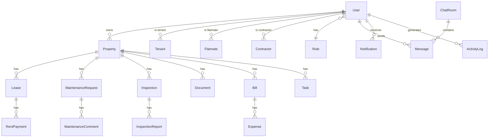

# Database Schema

## Entity Relationship Diagram

## Indexes

| Table | Index | Purpose |
|-------|-------|---------|
| users | email (unique) | Login lookup |
| users | role_id | RBAC queries |
| properties | owner_id | Landlord dashboard |
| rent_payments | lease_id, due_date | Rent ledger |
| rent_payments | status | Overdue queries |
| maintenance_requests | property_id, status | Dashboard |
| messages | room_id, created_at | Chat history |
| notifications | user_id, is_read | Notification center |
| activity_logs | user_id, created_at | Audit trail |

## Enums

- **UserRole**: tenant, flatmate, landlord, property_manager, contractor, admin
- **PropertyType**: house, apartment, unit, townhouse, studio
- **RentFrequency**: weekly, fortnightly, monthly
- **RentStatus**: paid, pending, overdue
- **BillType**: power, water, internet, gas, other
- **MaintenanceStatus**: submitted, reviewing, assigned, in_progress, completed
- **MaintenancePriority**: low, medium, high, urgent
- **InspectionStatus**: scheduled, completed, cancelled
- **ChatRoomType**: direct, group, property, maintenance
- **NotificationType**: rent_due, rent_overdue, maintenance, message, inspection, announcement, lease_expiry
- **TaskStatus**: pending, in_progress, completed
