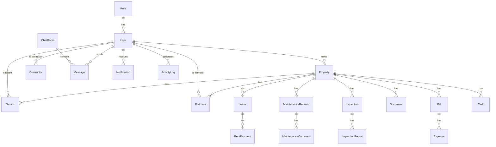

# HomeHub NZ — Database Schema Plan

> Planning document. Implementation lives in `backend/app/models/` and Alembic migrations.

## Overview

PostgreSQL database with SQLAlchemy ORM and Alembic migrations. All tables include `created_at` and `updated_at` timestamps.

## Entity Relationship Diagram



## Tables

### Core

| Table | Purpose | Key Fields |
|-------|---------|------------|
| `roles` | RBAC role definitions | name, description |
| `users` | All platform users | email, hashed_password, role_id, is_active, is_verified |

### Property Management

| Table | Purpose | Key Fields |
|-------|---------|------------|
| `properties` | Rental properties | owner_id, address, property_type, bedrooms, rent_amount, bond_amount |
| `tenants` | Tenant assignments | user_id, property_id, move_in_date, invitation_token |
| `flatmates` | Flatmate assignments | user_id, property_id, rent_share_percent |
| `leases` | Lease agreements | property_id, start_date, end_date, terms |
| `documents` | Uploaded files | property_id, file_url, document_type |

### Financial

| Table | Purpose | Key Fields |
|-------|---------|------------|
| `rent_payments` | Rent ledger entries | lease_id, amount, due_date, status, receipt_url |
| `bills` | Shared household bills | property_id, bill_type, amount, due_date, status |
| `expenses` | Per-user bill splits | bill_id, user_id, amount, share_percent, is_paid |

### Maintenance

| Table | Purpose | Key Fields |
|-------|---------|------------|
| `maintenance_requests` | Maintenance tickets | property_id, title, priority, status, assigned_to |
| `maintenance_comments` | Request comments | maintenance_id, user_id, content |
| `contractors` | Contractor profiles | user_id, company_name, specialties, rating |

### Inspections

| Table | Purpose | Key Fields |
|-------|---------|------------|
| `inspections` | Scheduled inspections | property_id, scheduled_date, status |
| `inspection_reports` | Inspection findings | inspection_id, findings, photo_urls, pdf_url |

### Communication

| Table | Purpose | Key Fields |
|-------|---------|------------|
| `chat_rooms` | Chat room metadata | room_type, property_id, participant_ids |
| `messages` | Chat messages | room_id, sender_id, content, is_read |
| `notifications` | In-app notifications | user_id, notification_type, title, body, is_read |

### Other

| Table | Purpose | Key Fields |
|-------|---------|------------|
| `tasks` | Household shared tasks | property_id, assigned_to, due_date, status |
| `activity_logs` | Audit trail | user_id, action, entity_type, entity_id |

## Enums

```
UserRole:           tenant | flatmate | landlord | property_manager | contractor | admin
PropertyType:       house | apartment | unit | townhouse | studio
RentFrequency:      weekly | fortnightly | monthly
RentStatus:         paid | pending | overdue
BillType:           power | water | internet | gas | other
MaintenanceStatus:  submitted | reviewing | assigned | in_progress | completed
MaintenancePriority: low | medium | high | urgent
InspectionStatus:   scheduled | completed | cancelled
ChatRoomType:       direct | group | property | maintenance
NotificationType:   rent_due | rent_overdue | maintenance | message | inspection | lease_expiry
TaskStatus:         pending | in_progress | completed
```

## Indexes (Planned)

| Table | Index | Purpose |
|-------|-------|---------|
| users | email (unique) | Login lookup |
| users | role_id | RBAC queries |
| properties | owner_id | Landlord dashboard |
| rent_payments | lease_id, due_date | Rent ledger |
| rent_payments | status | Overdue queries |
| maintenance_requests | property_id, status | Dashboard filters |
| messages | room_id, created_at | Chat history pagination |
| notifications | user_id, is_read | Notification center |
| activity_logs | user_id, created_at | Audit trail |

## Migration Strategy

1. `001_initial` — roles, users
2. `002_properties` — properties, tenants, flatmates, leases
3. `003_financial` — rent_payments, bills, expenses
4. `004_maintenance` — maintenance_requests, comments, contractors
5. `005_inspections` — inspections, inspection_reports
6. `006_communication` — chat_rooms, messages, notifications
7. `007_misc` — documents, tasks, activity_logs
